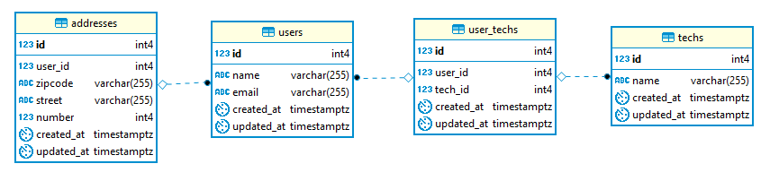

# Utilizando NodeJS com banco de dados

## Indice

1. [Introdução.](#introducao)
2. [Tecnologias.](#tecnologias)
3. [Estrutura do bando de dados.](#estruturadb)
4. [Estrutura de rotas.](#estruturarotas)

## <a id='introducao'></a> Introdução

Neste projeto foi contruido uma APIRest com Express utilizando a ORM Sequelize para fazer conexao com o banco de dados, colocando em pratica conteitos de banco de dados.

## <a id='tecnologias'></a>Tecnologias

### BackEnd

- NodeJS
- ExpressJS
- Sequelize

### Banco de dados

- PostGreSQL

## <a id='estruturadb'></a>Estrutura do bando de dados

<p align="center">

</p>

### Table users

```sql
CREATE TABLE public.users (
	id serial NOT NULL,
	"name" varchar(255) NOT NULL,
	email varchar(255) NOT NULL,
	created_at timestamptz NOT NULL,
	updated_at timestamptz NOT NULL,
	CONSTRAINT users_pkey PRIMARY KEY (id)
);
```

### Table addresses

```sql
CREATE TABLE public.addresses (
	id serial NOT NULL,
	user_id int4 NOT NULL,
	zipcode varchar(255) NOT NULL,
	street varchar(255) NOT NULL,
	"number" int4 NOT NULL,
	created_at timestamptz NOT NULL,
	updated_at timestamptz NOT NULL,
	CONSTRAINT addresses_pkey PRIMARY KEY (id),
	CONSTRAINT addresses_user_id_fkey FOREIGN KEY (user_id) REFERENCES users(id) ON UPDATE CASCADE ON DELETE CASCADE
);
```

### Table user_techs

```sql
CREATE TABLE public.user_techs (
	id serial NOT NULL,
	user_id int4 NOT NULL,
	tech_id int4 NOT NULL,
	created_at timestamptz NOT NULL,
	updated_at timestamptz NOT NULL,
	CONSTRAINT user_techs_pkey PRIMARY KEY (id),
	CONSTRAINT user_techs_tech_id_fkey FOREIGN KEY (tech_id) REFERENCES techs(id) ON UPDATE CASCADE ON DELETE CASCADE,
	CONSTRAINT user_techs_user_id_fkey FOREIGN KEY (user_id) REFERENCES users(id) ON UPDATE CASCADE ON DELETE CASCADE
);
```

### Table techs

```sql
CREATE TABLE public.techs (
	id serial NOT NULL,
	"name" varchar(255) NOT NULL,
	created_at timestamptz NOT NULL,
	updated_at timestamptz NOT NULL,
	CONSTRAINT techs_pkey PRIMARY KEY (id)
);
```

## <a id='estruturarotas'></a>Estrutura de rotas

### User

- get('/users', Listagem);
- post('/users', Cadastro);

### Address

- get('/users/:user_id/address', Listagem);
- post('/users/:user_id/address', Cadastro);

### Techs

- get('/users/:user_id/techs', Listagem);
- post('/users/:user_id/techs', Cadastro);
- delete('/users/:user_id/techs', Deletar);

### Report

- get('/report', Listagem);
